# AI Playbook for Software Developers - Netsmartz

## Document Information and Version Control

| Version No. | Details of Change | Creation Date | Prepared By |
|-------------|-------------------|---------------|-------------|
| 1.0 | Initial Copy - Spec-Driven Development Focus | 06-Oct-2025 | Software Engineering Sub Committee |
| 2.0 | Review and Enhancement | Q1 2026 | Software Engineering Sub Committee |

---

## Executive Summary

This playbook establishes comprehensive guidelines for software developers at Netsmartz to effectively integrate AI tools, particularly GitHub Copilot Business, into their development workflows. The approach emphasizes **specification-driven development** as a foundational methodology that transforms how we build software by making detailed specifications the primary source of truth rather than an afterthought.

### Key Principles

**Spec-First Development**: Every project begins with comprehensive specifications that serve as the blueprint for AI-assisted code generation and human validation.

**Human-AI Collaboration**: AI tools augment human expertise rather than replace it. All AI-generated code requires thorough human review, testing, and validation.

**Constitution-Driven Standards**: Project constitution files (`constitution.md`) establish coding standards, architectural principles, and quality gates that guide both human developers and AI tools.

**Security and Compliance**: Rigorous data privacy, security validation, and enterprise compliance measures ensure AI tools enhance rather than compromise our development practices.
### Target Audience

- **Primary**: Software developers, team leads, and architects at Netsmartz  
  - Responsible for creating and maintaining specifications, implementing code per constitution.md, conducting human reviews, and validating AI-generated output.

- **Secondary**: Project managers, QA engineers, and DevOps specialists  
  - Support feature planning, acceptance criteria, testing, CI/CD, and operational readiness for AI-enhanced projects.

- **Supporting stakeholders**: Security, Compliance, and IT/Helpdesk teams  
  - Ensure tool access, data governance, security assessments, and license provisioning align with enterprise policies.

Notes:
- All users must complete the required trainings and follow the access procedures in Section 1 before using AI development tools.
- Refer to the project constitution (constitution.md) for role-specific responsibilities and standards.
- Use this playbook to guide collaboration patterns and handoffs between roles.

### Expected Outcomes
- **Improved Development Velocity**: Faster feature development through AI-assisted code generation and specification-driven workflows
- **Enhanced Code Quality**: Consistent coding standards enforced through constitution-based development and AI-assisted reviews
- **Reduced Technical Debt**: Proactive specification-driven approach minimizes architectural inconsistencies and maintenance overhead
- **Better Documentation**: AI-assisted generation of comprehensive technical documentation that stays current with code changes

---

## 1. Required Trainings & Certifications

### Foundation Training Requirements

> ⚠️ **Important**: You must complete **26 hours of training** before accessing AI development tools. Plan accordingly and discuss with your manager to allocate dedicated time for learning.

All developers must complete the following training modules before accessing AI development tools. Training completion is tracked through the MIS-Smartz Portal and is a prerequisite for tool license approval.

| Training Name | Objective | Duration | Mode | Training Link |
|---------------|-----------|----------|------|---------------|
| Generative AI for Software Development | Comprehensive hands-on training covering AI tool integration, prompt engineering, code generation best practices, and development lifecycle integration | 15 hrs | Online | https://www.deeplearning.ai/courses/generative-ai-for-software-development/ |
| Generative AI in Software Development | Applied course focusing on practical AI-augmented coding, debugging techniques, embedding strategies, RAG implementation, and enterprise integration patterns | 3 hrs | Online | https://www.coursera.org/learn/generative-ai-in-software-development |
| Introduction to Generative AI for Developers With Copilot | Tool-specific introduction to GitHub Copilot usage, prompt engineering basics, IDE integration, and AI-augmented development workflows | 5 hrs | Online | https://www.coursera.org/learn/introduction-to-generative-ai-for-developers-with-copilot |
| Spec-Driven Development via GitHub Spec Kit | Microsoft's official methodology emphasizing specification-first development, constitutional programming, and structured AI collaboration over ad-hoc "vibe coding" | 3 hrs | Online | https://developer.microsoft.com/blog/spec-driven-development-spec-kit |

### Certification Validation

Upon completion of training modules:
1. **Knowledge Assessment**: Complete online assessments for each training module
2. **Practical Demonstration**: Submit a sample project demonstrating spec-driven development principles
3. **Constitution Creation**: Develop a project constitution following Netsmartz standards
4. **Peer Review**: Participate in code review exercises using AI-assisted workflows

> **Important**: Training links and availability are subject to change. Verify current course offerings and alignment with Netsmartz technology stack before enrollment. Consider piloting with small development teams first to validate training effectiveness and gather feedback for broader rollout.

## 2. AI Tools for Your Role

| Tool Name | Purpose | When to Use | License Type | Costing |
|-----------|---------|-------------|--------------|---------|
| GitHub Copilot Business | Code completion, generation, and documentation | Daily coding tasks | Business | $19 per month |

> 📖 **See Also**: For detailed workflows on how to use this tool effectively, see [Section 3: Workflows Powered by AI](#3-workflows-powered-by-ai)

## 3. Workflows Powered by AI

### Workflow Overview

This section contains 10 comprehensive workflows mapped to SDLC stages:

```mermaid
flowchart TD
    W1[Workflow 1: Project Initialization<br/>Constitution Setup<br/>⏱️ 2-4 hrs<br/>📍 SDLC: Planning]
    W2[Workflow 2: Requirements & Design<br/>Specify + Clarify + Plan<br/>⏱️ 3-6 hrs<br/>📍 SDLC: Planning & Design]
    W3[Workflow 3: Task Breakdown & Implementation<br/>Tasks + Analyze + Implement<br/>⏱️ Varies<br/>📍 SDLC: Design & Development]
    W4[Workflow 4: Code Development<br/>Constitution-Aware Coding<br/>⏱️ Ongoing<br/>📍 SDLC: Development]
    W5[Workflow 5: Documentation Generation<br/>Technical Specs & API Docs<br/>⏱️ 30min-2hrs<br/>📍 SDLC: Development]
    W6[Workflow 6: Bug Investigation & Resolution<br/>AI-Assisted Debugging<br/>⏱️ 1-4 hrs<br/>📍 SDLC: Testing]
    W7[Workflow 7: MCP Integration<br/>External Systems Optional<br/>⏱️ 1-2 hrs setup<br/>📍 SDLC: Cross-Cutting]
    W8[Workflow 8: AI Code Reviews<br/>Quality Gates & Compliance<br/>⏱️ 5-15 min<br/>📍 SDLC: Testing]
    W9[Workflow 9: Automated Tasks<br/>Maintenance & Updates<br/>⏱️ 15-30 min<br/>📍 SDLC: Maintenance]
    W10[Workflow 10: CI/CD Setup<br/>Quality Gates & Deployment<br/>⏱️ 2-4 hrs<br/>📍 SDLC: Deployment]
    
    W1 --> W2
    W2 --> W3
    W3 --> W4
    W4 --> W5
    W5 --> W8
    W8 --> W6
    W6 -.Fix & Retest.-> W4
    W8 -.Deploy Ready.-> W10
    W10 --> W9
    W9 -.Next Feature.-> W2
    
    style W1 fill:#e3f2fd
    style W10 fill:#e8f5e9
```



**SDLC Stage Mapping:**
- 🟨 **Planning & Analysis** (Workflows 1-2): Requirements gathering, constitution creation, specification development
- 🟪 **Design & Development** (Workflows 3-5): Architecture design, coding, documentation generation
- 🟧 **Testing & Quality** (Workflows 6, 8): Code reviews, bug fixing, quality assurance
- 🟩 **Deployment & Maintenance** (Workflows 9-10): CI/CD setup, automated maintenance tasks
- 🟦 **Advanced Integration** (Workflow 7): Optional MCP server integrations for enhanced capabilities

**Legend:**
- **Core Workflows** (1-3): Essential for all projects - start here
- **Daily Development** (4, 5, 8): Use regularly during active development
- **Advanced Workflows** (6, 7, 9, 10): Use as needed for specific scenarios

---

### Why Spec-Driven Development Matters

**Traditional development** often starts with coding and figures out requirements along the way. This leads to:
- Unclear project scope and requirements drift
- Inconsistent implementation decisions across team members
- Higher technical debt and maintenance costs
- Difficulty in code reviews and knowledge transfer
- Reduced code quality and testing coverage

**Spec-Driven Development** flips this approach by making specifications the primary source of truth and starting point for AI-assisted development. This methodology:
- **Reduces ambiguity**: Clear specifications eliminate guesswork and miscommunication
- **Improves consistency**: All team members work from the same detailed blueprint
- **Enables AI assistance**: AI tools can generate better code when given precise specifications as context
- **Enhances maintainability**: Well-defined specs make future changes and debugging easier
- **Increases predictability**: Project timelines become more accurate with clear scope definition

**Important**: AI-generated code from specifications should always be treated as a **first draft** requiring human review, testing, and validation. Specifications must be extremely precise to be effective.

> ⚠️ **Critical Reminder**: Never deploy AI-generated code without thorough testing and human review. AI tools are assistants, not replacements for developer judgment.

### The Power of Constitution.md

The `constitution.md` file serves as your project's **North Star** - a set of governing principles that guide every technical decision. Think of it as your team's shared understanding of:
- **Code quality standards** (testing requirements, documentation levels, performance benchmarks)
- **Architectural principles** (design patterns, security requirements, scalability considerations)
- **Development practices** (code review processes, deployment strategies, error handling approaches)
- **Business constraints** (compliance requirements, technology limitations, resource constraints)

When you establish a constitution early in your project, GitHub Copilot Business can use these principles as context to generate code that better aligns with your team's standards. However, **AI cannot automatically enforce all constitutional requirements** - human validation, testing, and post-generation checks are essential to ensure compliance.

> 💡 **Why This Matters**: A well-defined constitution reduces decision fatigue, improves onboarding, and ensures consistency across your entire codebase. It's the foundation that makes AI assistance truly effective.

### Primary Workflow: Spec-Driven Development with GitHub Copilot Business

> 📖 **Official Reference**: This workflow is based on the [GitHub Spec Kit](https://github.com/github/spec-kit) methodology. For complete details, see the [official Spec Kit documentation](https://github.github.io/spec-kit/).

#### Spec Kit Command Reference

After initializing your project with `specify init <project-name> --ai copilot`, you'll have access to these slash commands:

**Core Commands** (Essential workflow):
- `/speckit.constitution` - Create or update project governing principles
- `/speckit.specify` - Define what you want to build (requirements)
- `/speckit.clarify` - **REQUIRED**: Clarify underspecified areas before planning
- `/speckit.plan` - Create technical implementation plan with tech stack
- `/speckit.tasks` - Generate actionable task list from implementation plan
- `/speckit.implement` - Execute all tasks to build the feature

**Optional Commands** (Enhanced quality):
- `/speckit.analyze` - Cross-artifact consistency & coverage analysis (run after `/speckit.tasks`)
- `/speckit.checklist` - Generate custom quality checklists for validation

> ⚠️ **Command Syntax Note**: All Spec Kit commands use the `/speckit.*` prefix. Do not use shortened versions like `/specify`, `/plan`, or `/tasks` as they will not work correctly.

---

#### Workflow 1 – Spec-Driven Project Initialization with GitHub Copilot Business
⏱️ **Time to Complete**: 2-4 hours | 📚 **Difficulty**: Intermediate | 🎯 **Impact**: High

**Objective**: Initialize new projects using specification-first methodology with GitHub Copilot Business as your AI development partner

**Steps**:
• **Step 1** (Setup): Install Specify CLI and configure for GitHub Copilot
```bash
# Install Specify CLI (recommended - persistent installation)
uv tool install specify-cli --from git+https://github.com/github/spec-kit.git

# Initialize project with Copilot support
specify init <project-name> --ai copilot

# Or initialize in current directory
specify init . --ai copilot
# Or use the --here flag
specify init --here --ai copilot

# Force merge into non-empty directory (skip confirmation)
specify init . --force --ai copilot

# Verify installation
specify check
```

**Specify CLI Options** (Full Reference):
- `--ai <agent>` - AI assistant to use: `copilot`, `claude`, `gemini`, `cursor`, `windsurf`, etc.
- `--script <type>` - Script variant: `sh` (bash/zsh) or `ps` (PowerShell)
- `--here` - Initialize in current directory instead of creating new one
- `--force` - Force merge/overwrite when initializing in current directory
- `--no-git` - Skip git repository initialization
- `--ignore-agent-tools` - Skip checks for AI agent tools
- `--skip-tls` - Skip SSL/TLS verification (not recommended)
- `--debug` - Enable detailed debug output
- `--github-token <token>` - GitHub token for API requests (or set GH_TOKEN env var)

> 📖 **See Also**: For complete CLI documentation, see the [official Spec Kit CLI reference](https://github.com/github/spec-kit#-specify-cli-reference)

• **Step 2** (Constitution Creation): Establish project principles using GitHub Copilot Business
  - Open your IDE with GitHub Copilot Business enabled
  - Create a new file: `.specify/memory2wawtution.md`
  - Use Copilot Chat with this prompt:
```
Create a comprehensive project constitution for a Netsmartz enterprise software project. Include:
1. Code quality standards (unit testing requirements, code coverage thresholds, documentation standards)
2. Security requirements (authentication patterns, data encryption, vulnerability scanning)
3. Performance benchmarks (response time limits, scalability requirements, resource usage guidelines)
4. Architecture principles (microservices patterns, database design, API standards)
5. Development practices (code review process, deployment pipeline, error handling)
6. Netsmartz-specific constraints (approved technologies, compliance requirements, integration standards)
```

• **Step 3** (Constitution Refinement): Work with GitHub Copilot Business to refine the constitution
  - Review the generated constitution with your team
  - Use Copilot Chat to iterate and improve specific sections
  - Ensure alignment with Netsmartz enterprise standards
  - Get approval from your team lead or architect

**Why this matters**: The constitution becomes your AI assistant's guide for every subsequent code generation, ensuring consistency across your entire project.

> 📖 **See Also**: [Workflow 4: Constitution-Aware Code Development](#workflow-4--constitution-aware-code-development) and [The Power of Constitution.md](#the-power-of-constitutionmd)

#### Workflow 2 – Feature Specification and Planning with GitHub Copilot Business
⏱️ **Time to Complete**: 1-3 hours per feature | 📚 **Difficulty**: Intermediate | 🎯 **Impact**: High

**Objective**: Create detailed specifications and technical plans for new features using GitHub Copilot Business for intelligent assistance

**Steps**:
• **Step 1** (Requirements Input): Use Specify CLI with GitHub Copilot Business integration
```bash
/speckit.specify Build a user authentication system with multi-factor authentication, role-based access control, and integration with Netsmartz's Active Directory. The system should support OAuth 2.0, JWT tokens, and have audit logging capabilities.
```

• **Step 2** (Specification Enhancement): Leverage GitHub Copilot Business to refine specifications
  - Open the generated spec file in your IDE
  - Use Copilot Chat to expand on user stories:
```
Based on our constitution.md and the authentication requirements, generate detailed user stories with acceptance criteria for:
1. Multi-factor authentication flow
2. Role-based access control implementation
3. Active Directory integration
4. JWT token management
5. Audit logging system
Include security considerations and error handling scenarios.
```

• **Step 3** (Clarification with AI Assistance): Use `/speckit.clarify` with GitHub Copilot Business support
```bash
/speckit.clarify
```
  - Let GitHub Copilot Business help identify missing requirements
  - Use Copilot Chat to explore edge cases and integration scenarios
  - **Important**: This step is REQUIRED before creating your technical plan to reduce downstream rework

> ⚠️ **Required Step**: Always run `/speckit.clarify` before `/speckit.plan`. This structured clarification workflow ensures all ambiguities are resolved before technical decisions are made.

• **Step 4** (Technical Planning): Define tech stack and architecture with AI guidance
```bash
/speckit.plan Use .NET Core 8, Entity Framework, PostgreSQL, Redis for caching, and implement microservices architecture with Docker containers. Follow Netsmartz's cloud-first approach using Azure services.
```
  - GitHub Copilot Business will reference your constitution.md to ensure architectural decisions align with your established principles

• **Step 5** (Validation and Review): Use GitHub Copilot Business for comprehensive review
  - Ask Copilot Chat to validate the specification against your constitution
  - Generate architecture diagrams and system flows using Copilot's assistance
  - Create implementation checklists and validation criteria

#### Workflow 3 – Task Breakdown and Implementation with GitHub Copilot Business
⏱️ **Time to Complete**: Varies by feature complexity | 📚 **Difficulty**: Intermediate | 🎯 **Impact**: High

**Objective**: Break down features into actionable tasks and implement using GitHub Copilot Business for consistent, high-quality code generation

**Steps**:
• **Step 1** (AI-Enhanced Task Generation): Create detailed task breakdown with Copilot Business assistance
```bash
/speckit.tasks
```
  - GitHub Copilot Business analyzes your specification and constitution to generate implementation tasks
  - Tasks automatically align with your established coding standards and architectural principles

• **Step 2** (Intelligent Analysis): Ensure consistency and coverage with AI validation
```bash
/speckit.analyze
```
  - Copilot Business cross-references tasks against your constitution.md
  - Identifies potential gaps, dependencies, and integration points
  - Suggests additional tasks for security, testing, and documentation

• **Step 3** (Spec-Driven Implementation): Execute development plan with GitHub Copilot Business
```bash
/speckit.implement
```
  - GitHub Copilot Business generates code that automatically follows your constitution's guidelines
  - Implementation includes proper error handling, logging, and security measures as defined in your specs
  - Code generation respects your established patterns and architectural decisions

• **Step 4** (AI-Assisted Quality Assurance): Monitor and validate implementation
  - Use GitHub Copilot Business to generate comprehensive unit tests based on your specifications
  - Leverage Copilot Chat for code review assistance and improvement suggestions
  - Generate documentation that aligns with your constitution's documentation standards
  - Validate security and performance requirements through AI-assisted analysis

### Additional GitHub Copilot Business Workflows

#### Workflow 4 – Constitution-Aware Code Development
⏱️ **Time to Complete**: Ongoing during development | 📚 **Difficulty**: Beginner | 🎯 **Impact**: Medium

**Objective**: Generate high-quality code that automatically adheres to your project's established principles

**Steps**:
• **Step 1** (Context-Rich Setup): Leverage your constitution.md for consistent code generation
```csharp
// Based on our constitution.md requirements for authentication services:
// - Implement JWT token generation with 15-minute expiry (as per security standards)
// - Include comprehensive audit logging for all authentication events
// - Follow repository pattern with dependency injection
// - Implement circuit breaker pattern for external AD integration
// - Include proper error handling with structured logging
// - Generate XML documentation with security considerations
public class AuthenticationService : IAuthenticationService
{
```

• **Step 2** (AI-Guided Implementation): Let GitHub Copilot Business generate code using your constitution as context
  - Copilot automatically includes error handling patterns defined in your constitution
  - Security measures are implemented according to your established standards
  - Code structure follows your architectural principles
  
• **Step 3** (Constitution Validation): Use GitHub Copilot Business to validate against your standards
  - Ask Copilot Chat: "Review this code against our constitution.md requirements"
  - Generate unit tests that validate constitution compliance
  - Ensure documentation meets your established standards

#### Workflow 5 – Constitution-Driven Documentation Generation
⏱️ **Time to Complete**: 30 minutes - 2 hours | 📚 **Difficulty**: Beginner | 🎯 **Impact**: Medium

**Objective**: Generate comprehensive technical documentation that aligns with your project's established standards

**Steps**:
• **Step 1** (Constitution-Aware Documentation): Use GitHub Copilot Business with constitution context
```
Based on our constitution.md documentation standards, generate comprehensive documentation for this authentication service including:
- XML documentation with security considerations
- API documentation with authentication flows
- Integration guide for Active Directory connection
- Error handling documentation with response codes
- Performance benchmarks and SLA information
- Security audit trail documentation
Follow our established documentation templates and include all required sections per our constitution.
```

• **Step 2** (Automated Standards Compliance): GitHub Copilot Business generates documentation that automatically includes:
  - Required sections as defined in your constitution.md
  - Consistent formatting and structure across all documentation
  - Security considerations and compliance information
  - Integration examples and troubleshooting guides

• **Step 3** (Quality Validation): Validate documentation against constitution requirements
  - Use Copilot Chat to review documentation completeness
  - Ensure all constitutional requirements are addressed
  - Generate documentation checklists for team review

### Key Benefits of This Spec-Driven Approach with GitHub Copilot Business

**1. Improved Consistency**: Your constitution.md provides a shared reference point, helping maintain standards across projects (with human validation required).

**2. Reduced Decision Fatigue**: Established principles guide architectural decisions, allowing teams to focus more on business logic and less on repeated technical choices.

**3. Enhanced Onboarding**: New team members can understand project standards through the constitution, and AI assistance can help them learn established patterns more quickly.

**4. Better AI Context**: GitHub Copilot Business generates more relevant suggestions when provided with constitutional context, though **human review remains essential**.

**5. Scalable Standards**: The spec-driven approach helps maintain consistency as teams grow, but requires ongoing validation and enforcement processes.

**6. More Predictable Planning**: Clear specifications improve project estimation, though buffers for AI limitations and validation time should be included.

### Important Limitations and Considerations

**AI Limitations**:
- AI-generated code is a starting point, not a final solution
- Specifications must be extremely precise to be effective with AI
- Context windows and token limits may cause AI to miss important details
- Model drift and API changes can affect consistency over time

**Fallback Planning**:
- Maintain developer skills for manual coding when AI tools are unavailable
- Include cost monitoring for AI API usage in project budgets  
- Plan for AI service outages, rate limits, and pricing changes
- Keep traditional development workflows as backup options

> 📖 **See Also**: [Section 6: Cautions to be Taken](#6-cautions-to-be-taken) for more on risk management and [Section 9: Success Metrics](#9-success-metrics-and-kpis) for cost tracking strategies

#### Workflow 6 – AI-Powered Bug Investigation and Resolution
⏱️ **Time to Complete**: 1-4 hours per bug | 📚 **Difficulty**: Intermediate | 🎯 **Impact**: High

**Objective**: Systematically investigate, understand, and fix bugs using GitHub Copilot Business and integrated tools

> 💡 **When to Use**: Use this workflow when debugging complex issues, investigating production incidents, or conducting root cause analysis.

**Steps**:
• **Step 1** (Bug Context Gathering): Use MCP (Model Context Protocol) servers to gather comprehensive bug information
```bash
# Install and configure MCP server for Jira integration
npm install -g @mcp/jira-server
# Configure MCP server in your IDE settings to connect to Netsmartz Jira instance
```
  - GitHub Copilot Business can now access Jira tickets, comments, and related bug reports
  - Use Copilot Chat: "Analyze Jira ticket #PROJ-1234 and related issues to understand the bug context"

• **Step 2** (Code Analysis with Constitution Context): Leverage GitHub Copilot Business for intelligent bug analysis
```
Based on our constitution.md debugging standards and the information from Jira ticket #PROJ-1234:
1. Analyze the error stack trace and identify root cause
2. Review related code sections for similar patterns
3. Suggest debugging approaches that align with our logging standards
4. Identify potential security implications of this bug
5. Recommend testing strategies to prevent regression
```

• **Step 3** (Systematic Debugging): Use CLI tools with GitHub Copilot Business assistance
```bash
# Use GitHub CLI with Copilot integration for comprehensive investigation
gh copilot suggest "debug deadlock issue in Entity Framework with PostgreSQL"
gh issue list --label bug --assignee @me
gh pr list --search "related-to-authentication" --state merged
```

• **Step 4** (Constitution-Compliant Fix Implementation): Generate fixes that follow established standards
  - GitHub Copilot Business references your constitution.md for error handling patterns
  - Automatically includes proper logging, monitoring, and documentation
  - Suggests unit tests that validate the fix against constitutional requirements

• **Step 5** (Documentation and Knowledge Sharing): Create comprehensive fix documentation
  - Use Copilot to generate post-mortem analysis following your constitution's incident response format
  - Update knowledge base with debugging insights
  - Create preventive measures documentation

#### Workflow 7 – Enhanced Development with MCP Servers and CLI Tools
⏱️ **Time to Complete**: Setup 1-2 hours, then ongoing | 📚 **Difficulty**: Advanced | 🎯 **Impact**: Medium

**Objective**: Supercharge your development workflow by integrating external systems and tools through MCP servers

> ⚠️ **Security Warning**: MCP server integrations are experimental. Avoid connecting to production systems or sensitive data sources without proper security review and approval.

**Enhanced CLI and Integration Workflows (Current Capabilities)**:

• **GitHub CLI Integration** (Proven and Available):
```bash
# Install GitHub CLI with Copilot extension
gh extension install github/gh-copilot
gh copilot suggest "create PR template for our constitution compliance"
```

• **Manual Integration Patterns** (Recommended Approach):
  - **For Jira Integration**: Manually copy ticket details into Copilot Chat for analysis
  - **For Database Work**: Use existing database tools and paste schema information to Copilot for suggestions
  - **Security Note**: Avoid connecting AI directly to production systems or sensitive data sources

• **Future Experimental Integrations** (Use with Caution):
  - Custom MCP servers for Jira/database access are experimental
  - Require careful security review, access controls, and data sanitization
  - Test in isolated development environments only
  - Implement strong audit logging and access boundaries

• **Git/GitHub MCP Server Integration**:
```bash
# Enhanced GitHub CLI with MCP integration
gh extension install github/gh-copilot
gh copilot suggest "create PR template for our constitution compliance"
```

**Enhanced CLI Workflows**:

• **Intelligent Issue Management**:
```bash
# Use GitHub Copilot with CLI for smart issue handling
gh issue create --title "$(gh copilot suggest 'create bug title for authentication timeout')" \
  --body "$(gh copilot suggest 'create detailed bug report for JWT timeout issue')"
```

• **Smart Branch and PR Management**:
```bash
# Create feature branches with constitution-compliant naming
gh copilot suggest "create branch name for user authentication feature following our conventions"
# Generate PR descriptions that reference specifications
gh pr create --title "$(gh copilot suggest 'PR title for auth feature')" \
  --body "$(gh copilot suggest 'PR description referencing spec and constitution compliance')"
```

#### Workflow 8 – AI-Enhanced Code Reviews with GitHub Copilot
⏱️ **Time to Complete**: 5-15 minutes per review | 📚 **Difficulty**: Beginner | 🎯 **Impact**: High

**Objective**: Leverage GitHub Copilot's native code review capabilities for comprehensive, constitution-aware pull request reviews

> 💡 **Pro Tip**: Set up `.github/copilot-instructions.md` once and get consistent, constitution-aware reviews on every pull request automatically.

**Setup GitHub Copilot Code Review with Custom Instructions**:

• **Step 1** (Configure Repository-Wide Instructions): Create `.github/copilot-instructions.md` in your repository root
```markdown
# Netsmartz Constitution-Based Code Review Instructions

When performing code reviews, apply the following standards from our constitution.md:

## Code Quality Standards
- Ensure all methods have comprehensive XML documentation
- Verify unit test coverage meets our 80% minimum requirement
- Check that error handling follows our structured logging patterns
- Validate that async/await patterns are used correctly for I/O operations

## Security Requirements  
- Apply security checks from our `/security/security-checklist.md` file
- Verify authentication and authorization implementations follow our JWT patterns
- Check for SQL injection vulnerabilities and ensure parameterized queries
- Validate input sanitization and output encoding practices

## Performance Standards
- Review database queries for N+1 problems and missing indexes
- Check caching implementation against our Redis usage guidelines
- Verify API response times align with our SLA requirements (<200ms for CRUD operations)
- Ensure proper resource disposal and memory management

## Architecture Compliance
- Validate repository pattern implementation and dependency injection usage
- Check microservices communication follows our async messaging standards
- Ensure Docker containerization follows our established patterns
- Verify compliance with our established design patterns (CQRS, Event Sourcing)

Focus on readability, maintainability, and adherence to SOLID principles.
```

• **Step 2** (Create Path-Specific Instructions): For enhanced granular control, create specialized instructions
```bash
mkdir -p .github/instructions/src/api
mkdir -p .github/instructions/src/services
mkdir -p .github/instructions/tests
```

```markdown
# .github/instructions/src/api/api-review.instructions.md
When reviewing API controller code:
- Ensure all endpoints have proper OpenAPI documentation
- Verify request/response DTOs follow our naming conventions
- Check that proper HTTP status codes are returned
- Validate input validation and model binding
- Ensure proper exception handling middleware usage
```

**Code Review Workflow Steps**:

• **Step 1** (Request Copilot Review): In your pull request on GitHub.com
  1. Navigate to your pull request
  2. Open the **Reviewers** menu
  3. Select **Copilot** from the dropdown
  4. Wait for Copilot to complete the review (typically <30 seconds)

• **Step 2** (Review Copilot's Feedback): Copilot provides comprehensive analysis including:
  - Constitution compliance assessment based on your custom instructions
  - Security vulnerability identification
  - Performance optimization suggestions with code examples
  - Code quality improvements with suggested changes
  - Documentation completeness review

• **Step 3** (Apply Suggested Changes): Work with Copilot's actionable feedback
  - **Single suggestion**: Click "Apply suggestion" to commit individual changes
  - **Multiple suggestions**: Select multiple suggestions and commit as a batch
  - **Custom modifications**: Use suggestions as guidance for manual improvements

• **Step 4** (Interact with Review Comments): Engage with Copilot's feedback
  - Add 👍 (thumbs up) for helpful suggestions
  - Add 👎 (thumbs down) with specific feedback for improvement
  - Resolve conversations after addressing issues
  - Add follow-up comments for human reviewers (Copilot won't see these)

• **Step 5** (Request Re-review When Needed): After making changes
  - Push your updates to the pull request branch
  - Click the 🔄 button next to **Copilot** in the Reviewers menu to request a re-review
  - Review new feedback and address any remaining issues

**Advanced Configuration Options**:

• **Automatic Reviews Setup**: Configure Copilot to automatically review all PRs
```yaml
# .github/copilot-auto-review.yml (if supported by your organization)
auto_review:
  enabled: true
  triggers:
    - pull_request_opened
    - pull_request_updated
  exclude_paths:
    - "docs/**"
    - "*.md"
```

• **Integration with Specification Validation**: Enhance instructions for spec-driven development
```markdown
# Additional instruction in .github/copilot-instructions.md

## Specification Compliance
When reviewing code changes:
- Compare implementation against specifications in `.specify/specs/` directory
- Verify that user stories and acceptance criteria are fully addressed
- Check that API contracts match the defined schemas
- Ensure database changes align with data model specifications
- Validate that security requirements from specifications are implemented
```

**Best Practices for Constitution-Aware Reviews**:

• **Provide Context**: Include links to relevant constitution sections in your PR descriptions
```markdown
## Constitution Compliance Checklist
This PR implements authentication features per our constitution requirements:
- [x] JWT token implementation (Section 3.2)
- [x] Audit logging (Section 4.1) 
- [x] Input validation (Section 5.3)
- [] Performance testing (Section 6.2) - pending QA review
```

• **Leverage Feedback Loop**: Continuously improve your instructions based on Copilot's performance
  - Monitor thumbs up/down ratios on Copilot reviews
  - Update `.github/copilot-instructions.md` based on recurring issues
  - Refine path-specific instructions for better targeting

• **Combine with Human Reviews**: Use Copilot as first-line review, humans for business logic
  - Copilot reviews provide "Comment" status (won't block merging)
  - Still require human approval for constitution compliance sign-off
  - Use Copilot feedback to prepare more focused human reviews

#### Workflow 9 – Automated Laborious Tasks with GitHub Copilot Coding Agent
⏱️ **Time to Complete**: Setup 15-30 min, execution varies | 📚 **Difficulty**: Intermediate | 🎯 **Impact**: Very High

**Objective**: Use GitHub Copilot's coding agent to handle repetitive, time-consuming development tasks automatically

> 💡 **Best Use Cases**: Adding logging, upgrading dependencies, implementing tests, standardizing code formatting, migrating patterns across large codebases.

**Common Laborious Tasks for Netsmartz Projects**:
- Adding comprehensive logging throughout existing codebases
- Upgrading deprecated dependencies and APIs
- Implementing missing unit tests across multiple files
- Adding error handling to legacy code
- Standardizing code formatting and documentation
- Migrating authentication patterns
- Adding security headers and validation

**Method 1: Creating Issues and Assigning to Copilot**

• **Step 1** (Create Comprehensive Task Issues): Document laborious tasks as GitHub Issues with detailed requirements
```markdown
# Example Issue: "Add Comprehensive Logging to Authentication Module"
## Description
Add structured logging throughout the authentication module following our constitution.md logging standards.

## Requirements
- Add debug, info, warn, and error logs at appropriate levels
- Include correlation IDs for request tracking
- Follow our established logging patterns from constitution.md
- Ensure no sensitive data (passwords, tokens) are logged
- Add performance logging for slow operations (>100ms)

## Files to Update
- `/src/Services/AuthenticationService.cs`
- `/src/Controllers/AuthController.cs` 
- `/src/Middleware/JwtMiddleware.cs`
- `/src/Validators/LoginValidator.cs`

## Acceptance Criteria
- [ ] All methods have entry/exit logging
- [ ] Error scenarios are properly logged with context
- [ ] Performance metrics are captured
- [ ] Log levels follow our severity guidelines
- [ ] Unit tests validate logging behavior
```

• **Step 2** (Assign to Copilot with Constitution Context): Assign the issue to Copilot
  1. Navigate to the issue on GitHub.com
  2. Click **Assignees** in the right sidebar
  3. Select **Copilot** from the assignees list
  4. In the **Optional prompt field**, add constitution-specific guidance:
```
Follow our constitution.md logging standards when implementing this task:
- Use structured logging with correlation IDs
- Implement proper log levels (Debug/Info/Warn/Error)
- Never log sensitive authentication data
- Include performance metrics for operations >100ms
- Follow our established error handling patterns
- Generate comprehensive unit tests for all logging scenarios
```

• **Step 3** (Monitor and Review): Copilot creates a PR and requests your review
  - Review the generated code against your constitution requirements
  - Test the logging implementation in development environment
  - Provide feedback using thumbs up/down on Copilot's changes
  - Request re-work if needed before merging

**Method 2: Direct Prompt from Multiple Interfaces**

• **From GitHub.com Copilot Chat**:
```
Create a PR in netsmartz/ecommerce-api to upgrade all Entity Framework dependencies from version 6.x to 8.x. Follow our constitution.md upgrade procedures:
1. Update all package references to EF Core 8.x
2. Migrate deprecated APIs to new equivalents  
3. Update connection string configurations
4. Modify startup configuration for new DI patterns
5. Add migration scripts for database schema changes
6. Update unit tests to work with new EF patterns
7. Ensure all breaking changes are documented
```

• **From Visual Studio Code with GitHub Copilot**:
```
Add comprehensive error handling to all API controllers following our constitution standards #copilotCodingAgent

Requirements:
- Implement global exception middleware
- Add try-catch blocks with structured logging
- Return appropriate HTTP status codes
- Include correlation IDs in error responses
- Follow our established error response format
- Add unit tests for error scenarios
```

• **From GitHub CLI**:
```bash
gh agent-task create "Add missing unit tests to achieve 80% code coverage requirement from constitution.md. Focus on Services and Controllers directories. Include integration tests for database operations and API endpoints. Follow our established testing patterns and mocking strategies."
```

• **From GitHub Issues Assignment**:
```markdown
# Issue Title: Upgrade Deprecated Authentication Dependencies
@copilot Please upgrade our authentication system dependencies:

## Current State
- Microsoft.AspNetCore.Authentication.JwtBearer v5.0.12
- System.IdentityModel.Tokens.Jwt v6.8.0  
- Microsoft.AspNetCore.Identity v5.0.12

## Target State
- Upgrade to latest stable versions (8.x)
- Migrate deprecated APIs and patterns
- Update configuration for new dependency injection
- Ensure JWT token validation still works correctly
- Maintain backward compatibility where possible

## Constitution Requirements
- Follow our security upgrade procedures
- Add comprehensive testing for auth flows
- Document all breaking changes
- Ensure performance doesn't degrade
```

**Method 3: Repository-Wide Maintenance Tasks**

• **Create Maintenance Issues for Large-Scale Updates**:
```markdown
# Issue: Standardize Logging Across Entire Codebase
## Scope
Update all 47 service classes to follow constitution.md logging standards

## Requirements from Constitution
- Structured logging with Serilog
- Correlation ID tracking
- Performance monitoring integration
- Error categorization (Business/Technical/Security)
- Consistent log message formatting

## Automated Tasks Needed
- Add ILogger injection to all service constructors
- Implement entry/exit logging for public methods
- Add error logging with proper context
- Include performance counters for slow operations
- Generate unit tests for logging verification
```

**Method 4: Advanced GitHub CLI Automation**

• **Batch Task Creation**:
```bash
# Create multiple related tasks for comprehensive updates
gh agent-task create "Phase 1: Add structured logging to all Controller classes" --base main --repo netsmartz/ecommerce-api

gh agent-task create "Phase 2: Add structured logging to all Service classes" --base main --repo netsmartz/ecommerce-api  

gh agent-task create "Phase 3: Add structured logging to all Repository classes" --base main --repo netsmartz/ecommerce-api
```

• **Follow Task Progress**:
```bash
# Monitor active Copilot sessions
gh agent-task list --status active

# Follow specific task progress
gh agent-task create "Add comprehensive input validation" --follow
```

**Best Practices for Laborious Task Automation**:

• **Break Down Large Tasks**: Split complex work into manageable, focused issues
• **Provide Comprehensive Context**: Include constitution requirements, existing patterns, and specific file paths
• **Set Clear Acceptance Criteria**: Define exactly what "done" looks like
• **Test Incrementally**: Review and test each automated change before proceeding
• **Document Changes**: Ensure Copilot includes proper documentation and comments
• **Validate Constitution Compliance**: Always verify generated code follows your established standards

#### Workflow 10 – Continuous Integration with AI-Enhanced Quality Gates
⏱️ **Time to Complete**: Setup 2-4 hours | 📚 **Difficulty**: Advanced | 🎯 **Impact**: Medium

**Objective**: Implement AI-assisted quality gates that support constitution compliance (Experimental)

> ⚠️ **Experimental Feature**: This workflow is still evolving. Test thoroughly in non-production environments before implementing.

**Current Approach - Manual AI-Assisted Reviews**:
```yaml
# .github/workflows/constitution-check.yml
name: Constitution Compliance Check
on: [pull_request]
jobs:
  basic-compliance:
    runs-on: ubuntu-latest
    steps:
    - uses: actions/checkout@v3
    - name: Check Constitution File Exists
      run: |
        if [ ! -f "constitution.md" ]; then
          echo "::error::constitution.md file not found"
          exit 1
        fi
    - name: Run Standard Linting
      run: |
        # Use existing linters and static analysis tools
        # AI integration for automated reviews is still experimental
```

**Future Vision - AI Integration** (Requires Validation):
- Automated constitution compliance checking through AI analysis
- AI-generated review comments based on constitutional requirements  
- **Note**: Specific GitHub Actions for Copilot CLI integration are still being developed
- Test any AI-powered CI/CD workflows thoroughly in non-production environments first

### Getting Started Checklist

Before beginning any new project with this spec-driven approach:

- [ ] Install and configure GitHub Copilot Business in your IDE
- [ ] Install Specify CLI: `uv tool install specify-cli --from git+https://github.com/github/spec-kit.git`
- [ ] Verify installation with: `specify check`
- [ ] Set up MCP servers for Jira, database, and other integrations (optional)
- [ ] Install and configure GitHub CLI with Copilot extension: `gh extension install github/gh-copilot`
- [ ] Upgrade GitHub CLI to v2.80.0+ for agent-task commands: `gh extension upgrade gh-copilot`
- [ ] Create a comprehensive constitution.md with your team's standards
- [ ] Set up `.github/copilot-instructions.md` for repository-wide AI guidance
- [ ] Complete the required training modules (see Section 1)
- [ ] Establish team review processes for constitution updates
- [ ] Set up templates for specifications and documentation
- [ ] Configure GitHub Actions for AI-enhanced quality gates  
- [ ] Create validation checklists for constitution compliance
- [ ] Set up MCP server configurations for your development environment (optional)
- [ ] Create issue templates for common laborious tasks (logging, dependency upgrades, testing)
- [ ] Establish maintenance schedules for automated code improvements
- [ ] Configure Copilot coding agent access in your organization settings

> 💡 **Pro Tip**: Run `specify check` after installation to verify all prerequisites are met and identify any missing tools.

## 4. Development Phase Guidelines

### Phase 1: 0-to-1 Development (Greenfield Projects)
**Focus**: Generate new applications from scratch using specification-first approach

**AI-Powered Activities**:
- Use Specify CLI for project initialization
- Leverage AI agents for requirement analysis and specification creation
- Generate complete application scaffolding with proper architecture
- Implement comprehensive testing strategies from the start

**Key Tools**: Specify CLI, Claude Code, GitHub Copilot, Cursor IDE

### Phase 2: Creative Exploration
**Focus**: Explore multiple implementation approaches and technology stacks

**AI-Powered Activities**:
- Generate parallel implementations using different AI agents
- Compare architectural approaches using AI analysis
- Experiment with new frameworks and patterns
- Validate approaches through AI-assisted prototyping

**Key Tools**: Multiple AI agents, Cursor IDE, Claude Code

### Phase 3: Iterative Enhancement (Brownfield Projects)
**Focus**: Modernize and enhance existing systems

**AI-Powered Activities**:
- Analyze existing codebase for improvement opportunities
- Generate modernization plans using AI insights
- Implement incremental improvements with AI assistance
- Refactor legacy code following modern patterns

**Key Tools**: GitHub Copilot, ChatGPT Enterprise, Cursor IDE

## 5. AI-Powered Best Practices for Netsmartz Developers

### Code Quality Standards
- Always validate AI-generated code against Netsmartz coding standards
- Use AI tools to generate unit tests with high coverage requirements
- Implement AI-assisted code reviews for consistency
- Leverage AI for security vulnerability scanning

### Performance Optimization
- Use AI agents to identify performance bottlenecks
- Generate optimized algorithms and data structures
- Implement AI-suggested caching strategies
- Monitor and optimize database queries with AI assistance

### Documentation Requirements
- Generate comprehensive API documentation using AI tools
- Create architectural decision records (ADRs) with AI assistance
- Maintain up-to-date technical documentation using AI
- Generate user guides and deployment instructions

### Security Considerations
- Validate all AI-generated code for security vulnerabilities
- Use AI tools for threat modeling and security analysis
- Implement AI-assisted security testing
- Follow secure coding practices with AI guidance

## 6. Cautions to be Taken

### Data Security and Privacy
- **Never feed confidential client data, proprietary algorithms, or sensitive business logic into external AI tools**
- Use only approved AI tools with enterprise-grade security
- Ensure all AI tool usage complies with Netsmartz data governance policies
- Regularly review and audit AI tool access and usage
- **Implement data sanitization** for any information shared with AI tools
- Be cautious with experimental integrations (MCP servers) - require security review

> ⚠️ **Critical**: Violation of data security policies can result in serious consequences. When in doubt, consult with your team lead or security team before sharing any data with AI tools.
> 
> 📖 **See Also**: [Workflow 7: MCP Server Security](#workflow-7--enhanced-development-with-mcp-servers-and-cli-tools) for integration security guidelines

### Code Quality and Validation
- **Always review and test AI-generated code thoroughly before deployment**
- Treat all AI output as **first draft requiring validation**
- Validate AI suggestions against Netsmartz architectural standards
- Ensure AI-generated code follows security best practices
- Never deploy AI-generated code without proper code review
- **Implement automated validation**: Use linters, static analysis, and constitution compliance checkers
- **Test incrementally**: Don't batch large AI-generated changes without intermediate validation

> 💡 **Best Practice**: Use [Workflow 8: AI-Enhanced Code Reviews](#workflow-8--ai-enhanced-code-reviews-with-github-copilot) to get AI assistance with review, but always have human approval as the final gate.
> 
> 📖 **See Also**: [Section 5: AI-Powered Best Practices](#5-ai-powered-best-practices-for-netsmartz-developers) for quality standards

### Intellectual Property Protection
- Be cautious about sharing proprietary code patterns with external AI services
- Understand the terms of service for each AI tool regarding code ownership
- Document AI tool usage for compliance and audit purposes
- Ensure AI-generated code doesn't violate third-party licenses

### Technical Dependencies and Risk Management
- **Avoid over-reliance on AI tools** for critical decision-making
- Maintain human expertise and judgment in architectural decisions
- **Keep fallback plans** for when AI tools are unavailable, slow, or expensive
- **Monitor costs**: AI API usage can scale unexpectedly
- Regularly validate AI suggestions against industry best practices
- **Plan for model drift**: AI behavior changes over time with updates
- **Include learning curves**: Don't expect immediate productivity gains
- **Governance and rollback strategies**: Have plans for scaling back AI usage if needed

> 💡 **Reality Check**: Teams typically see productivity gains after 2-3 weeks of learning. Budget extra time for initial projects.
> 
> 📖 **See Also**: [Section 9: Success Metrics - Risk Indicators](#9-success-metrics-and-kpis) for tracking maturity and [Section 10: Continuous Improvement](#10-continuous-improvement-process) for adaptation strategies

## 7. License & Access Information

To access any AI tool license, you must first complete the required training via the MIS-Smartz Portal:

1. **Complete Training**: Finish all mandatory AI development training modules
2. **Access Portal**: Navigate to the AI Tools section in MIS-Smartz Portal
3. **Tool Selection**: Choose the required AI development tool
4. **Request License**: Click "Request License" and complete the form
5. **Approval Process**: Your request will follow the defined approval workflow
6. **Credential Delivery**: Receive login credentials via email after approval

### Prerequisites for License Approval
- Completion of all required training modules
- Manager approval for tool necessity
- Agreement to AI tool usage policies
- Commitment to following Netsmartz development standards

> 📖 **See Also**: [Section 1: Required Trainings](#1-required-trainings--certifications) for training requirements and [Section 8: Support & Helpdesk](#8-support--helpdesk) if you experience issues with license requests

## 8. Support & Helpdesk

### Knowledge Base / FAQs for AI Development Tools
• **First Level Support**: Access our comprehensive Knowledge Base through [AI Development Tools Portal]
• **Resources Available**:
  - Spec-Driven Development quick start guides
  - AI tool integration tutorials
  - Troubleshooting guides for common issues
  - Best practice examples and templates
  - Video tutorials for complex workflows

### AI Champion for Software Development Role
• **Dedicated Expert Support**: Each development team has a designated AI Champion
• **Software Development AI Champion**:
  - **Name**: [To be assigned - Senior Software Architect]
  - **Department**: Software Engineering
  - **Email**: [ai-champion-dev@netsmartz.com]
  - **Specialization**: Spec-Driven Development, AI-Assisted Architecture Design
  - **Office Hours**: Monday-Friday, 9 AM - 5 PM EST

### Developer AI Community of Practice
• **Community Platform**: Microsoft Teams workspace for AI in Software Development
• **Activities**:
  - Weekly "AI Dev Showcase" sessions every Friday
  - Monthly "Spec-Driven Development" workshops
  - Quarterly "AI Tools Evaluation" sessions
  - Peer code review and knowledge sharing
• **Access**: Join via MS Teams through [Developer AI Community Link]

### Technical Support Escalation
• **Level 1**: Knowledge Base and self-service resources
• **Level 2**: AI Champion consultation and guidance
• **Level 3**: Community of Practice peer support
• **Level 4**: Software Engineering Leadership team
• **Level 5**: External vendor support (for licensed tools)

## 9. Success Metrics and KPIs

### Development Productivity Metrics
- **Feature Delivery Speed**: Measure time from specification to production deployment (include validation time)
- **Code Quality**: Track defect rates in AI-assisted vs. traditional development  
- **Test Coverage**: Monitor test coverage, but validate that AI-generated tests are meaningful
- **Documentation Completeness**: Assess quality and accuracy of AI-generated documentation
- **Revision Cycles**: Track how often AI-generated code requires human correction

### AI Tool Adoption Metrics
- **Tool Utilization**: Track active usage of each AI development tool
- **Developer Satisfaction**: Regular surveys on AI tool effectiveness and learning curves
- **Training Completion**: Monitor completion rates for required AI training
- **Best Practice Compliance**: Audit adherence to AI development guidelines
- **Cost Tracking**: Monitor AI API usage costs and budget impact

### Business Impact Metrics (with Realistic Expectations)
- **Time to Market**: Measure changes in project delivery timelines (may initially be slower due to learning curve)
- **Client Satisfaction**: Track client feedback on AI-enhanced project deliveries
- **Innovation Rate**: Count new features and improvements enabled by AI tools
- **Cost Efficiency**: Calculate total ROI including training, tools, and validation overhead
- **Quality Metrics**: Track production bugs and security issues in AI-assisted code

### Risk and Maturity Indicators
- **Fallback Usage**: Track how often teams revert to traditional development methods
- **Error Rates**: Monitor frequency of AI-generated code requiring significant rework
- **Security Incidents**: Track any security issues related to AI tool usage
- **Compliance Gaps**: Measure constitution adherence in AI-generated vs. manual code

## 10. Continuous Improvement Process

### Monthly Reviews
- Evaluate new AI tools and technologies (with careful piloting)
- Review and update development workflows based on real usage data  
- Assess training needs and skill gaps
- Update best practices based on lessons learned and failure cases
- **Review costs and usage patterns** to ensure budget alignment

### Quarterly Assessments  
- Comprehensive review of AI tool effectiveness vs. initial expectations
- Update playbook based on industry developments and proven practices
- Evaluate and adjust success metrics based on actual outcomes
- Plan advanced training and certification programs
- **Assess risk mitigation strategies** and fallback plan effectiveness

### Annual Strategy Review
- Assess overall AI development strategy alignment with business goals
- Evaluate budget and resource allocation (including hidden costs)
- Set realistic goals for next year's AI development initiatives
- Review and update enterprise AI policies
- **Conduct thorough ROI analysis** including all costs and benefits
- **Review competitive landscape** and industry best practices evolution

### Continuous Learning and Adaptation
- **Maintain awareness** that AI landscape changes rapidly
- **Stay connected** with industry communities and research
- **Plan for technology changes** including model updates and new tools
- **Document failures and learnings** to improve future implementations

---

## Glossary

### A-C

**ADR (Architectural Decision Record)**: A document that captures an important architectural decision made along with its context and consequences.

**AI Agent**: An AI-powered tool or system that can perform tasks autonomously or semi-autonomously, such as code generation or analysis.

**API (Application Programming Interface)**: A set of protocols and tools for building software applications that specify how software components should interact.

**CI/CD (Continuous Integration/Continuous Deployment)**: Automated processes for integrating code changes and deploying applications to production.

**Constitution.md**: A project-specific file that defines coding standards, architectural principles, and quality gates that guide development decisions.

**CQRS (Command Query Responsibility Segregation)**: A design pattern that separates read and write operations for a data store.

### D-G

**DTO (Data Transfer Object)**: An object that carries data between processes to reduce the number of method calls.

**Entity Framework**: An object-relational mapping (ORM) framework for .NET that enables developers to work with databases using .NET objects.

**GitHub Copilot Business**: An AI-powered code completion tool that suggests code and entire functions in real-time within your editor.

**Greenfield Project**: A project that is started from scratch without the need to consider prior work or legacy systems.

### H-M

**IDE (Integrated Development Environment)**: A software application that provides comprehensive facilities for software development (e.g., Visual Studio Code, Visual Studio).

**JWT (JSON Web Token)**: A compact, URL-safe means of representing claims to be transferred between two parties for authentication.

**MCP (Model Context Protocol)**: A protocol that allows AI tools to access external data sources and systems in a structured way.

**Microservices**: An architectural style that structures an application as a collection of loosely coupled, independently deployable services.

### N-R

**OAuth 2.0**: An industry-standard protocol for authorization that allows applications to obtain limited access to user accounts.

**OpenAPI**: A specification for building APIs that defines a standard, language-agnostic interface description for HTTP APIs.

**PostgreSQL**: An open-source relational database management system emphasizing extensibility and SQL compliance.

**Prompt Engineering**: The practice of crafting effective input prompts to get desired outputs from AI language models.

**RAG (Retrieval-Augmented Generation)**: A technique that enhances AI responses by retrieving relevant information from external knowledge bases before generating output.

**Redis**: An open-source, in-memory data structure store used as a database, cache, and message broker.

**Repository Pattern**: A design pattern that mediates between the domain and data mapping layers using a collection-like interface for accessing domain objects.

### S-Z

**Spec-Driven Development**: A methodology where detailed specifications are created before implementation, serving as the blueprint for AI-assisted code generation.

**Specify CLI**: A command-line interface tool for implementing spec-driven development workflows with GitHub Copilot and other AI agents.

**Spec Kit**: GitHub's official framework and toolset for Spec-Driven Development, including the Specify CLI and slash command templates.

**Slash Commands**: Special commands prefixed with `/speckit.*` that are available in AI coding agents after running `specify init`. Examples: `/speckit.specify`, `/speckit.plan`, `/speckit.implement`.

**SOLID Principles**: Five design principles (Single Responsibility, Open-Closed, Liskov Substitution, Interface Segregation, Dependency Inversion) intended to make software designs more understandable, flexible, and maintainable.

**Technical Debt**: The implied cost of additional rework caused by choosing an easy solution now instead of a better approach that would take longer.

**Token**: In AI context, a piece of text (word, part of word, or character) that the AI model processes. Most AI models have token limits for input and output.

**Unit Test**: A type of software testing where individual components of the software are tested in isolation from the rest of the application.

**UV**: A fast Python package installer and resolver, required for installing and managing the Specify CLI tool.

**Vibe Coding**: An informal, ad-hoc approach to development without clear specifications or structure (contrasted with spec-driven development).

---

## 11. Troubleshooting Common Issues

### Training and Setup Issues

**Problem**: Cannot access training materials
- **Solution**: Verify your MIS-Smartz Portal credentials
- **Solution**: Contact your manager to ensure training has been approved and assigned
- **See Also**: [Section 1: Required Trainings](#1-required-trainings--certifications)

**Problem**: GitHub Copilot not activating in IDE
- **Solution**: Verify you have a valid license through GitHub settings
- **Solution**: Check that the Copilot extension is installed and enabled
- **Solution**: Sign out and sign back in to refresh authentication
- **See Also**: [Section 7: License & Access Information](#7-license--access-information)

**Problem**: Specify CLI not found after installation
- **Solution**: Ensure `uv` is installed: `curl -LsSf https://astral.sh/uv/install.sh | sh`
- **Solution**: Verify installation: `specify check`
- **Solution**: Check that uv tools are in your PATH: `export PATH="$HOME/.local/bin:$PATH"`
- **Solution**: Restart your terminal after installation
- **See Also**: [Workflow 1: Project Initialization](#workflow-1--spec-driven-project-initialization-with-github-copilot-business)

**Problem**: Slash commands not appearing in IDE
- **Solution**: Ensure you ran `specify init <project-name> --ai copilot`
- **Solution**: Check that `.specify/` directory exists in your project
- **Solution**: Restart your IDE after project initialization
- **Solution**: Verify the correct agent is configured in your project
- **See Also**: [Spec Kit Command Reference](#spec-kit-command-reference)

### Workflow Issues

**Problem**: Specify CLI commands not working
- **Solution**: Ensure you have installed the CLI: `uv tool install specify-cli --from git+https://github.com/github/spec-kit.git`
- **Solution**: Check that `uv` tool is installed and in your PATH
- **Solution**: Verify you have initialized the project: `specify init <project-name> --ai copilot`
- **Solution**: Run `specify check` to diagnose missing prerequisites
- **See Also**: [Workflow 1: Project Initialization](#workflow-1--spec-driven-project-initialization-with-github-copilot-business)

**Problem**: Slash commands using wrong syntax (e.g., `/specify` instead of `/speckit.specify`)
- **Solution**: All Spec Kit commands must use the `/speckit.*` prefix
- **Solution**: Update your prompts to use correct syntax: `/speckit.specify`, `/speckit.plan`, etc.
- **Solution**: Check the [Spec Kit Command Reference](#spec-kit-command-reference) for complete list
- **See Also**: [Official Spec Kit Documentation](https://github.com/github/spec-kit)

**Problem**: Getting errors about missing clarifications when running `/speckit.plan`
- **Solution**: Run `/speckit.clarify` BEFORE `/speckit.plan` - this is a required step
- **Solution**: The clarification step resolves ambiguities and prevents downstream rework
- **Solution**: Review the clarifications section in your spec.md file
- **See Also**: [Workflow 2: Feature Specification](#workflow-2--feature-specification-and-planning-with-github-copilot-business)

**Problem**: AI-generated code doesn't follow our standards
- **Solution**: Ensure `constitution.md` is properly created and located in `.specify/memory/`
- **Solution**: Make your constitution more specific and detailed
- **Solution**: Reference the constitution explicitly in your prompts
- **Solution**: Remember that human review is always required
- **See Also**: [The Power of Constitution.md](#the-power-of-constitutionmd)

**Problem**: GitHub Copilot suggestions are not relevant
- **Solution**: Provide more context in your code comments
- **Solution**: Open related files to give Copilot more context
- **Solution**: Use more specific variable and function names
- **Solution**: Try rephrasing your comments or prompts
- **See Also**: [Workflow 4: Constitution-Aware Code Development](#workflow-4--constitution-aware-code-development)

### Code Review Issues

**Problem**: Copilot not appearing as a reviewer option
- **Solution**: Verify your organization has enabled Copilot code reviews
- **Solution**: Check that you have the latest version of GitHub Copilot
- **Solution**: Ensure the pull request is in a repository with Copilot access
- **See Also**: [Workflow 8: AI-Enhanced Code Reviews](#workflow-8--ai-enhanced-code-reviews-with-github-copilot)

**Problem**: Copilot review feedback is too generic
- **Solution**: Create or enhance `.github/copilot-instructions.md` with specific standards
- **Solution**: Add path-specific instructions for different code areas
- **Solution**: Reference your constitution.md in the instructions
- **See Also**: [Workflow 8: Setup Instructions](#setup-github-copilot-code-review-with-custom-instructions)

### MCP Server and Integration Issues

**Problem**: MCP server connection failing
- **Solution**: Verify MCP server is properly installed: `npm install -g @mcp/jira-server`
- **Solution**: Check your IDE settings for MCP server configuration
- **Solution**: Ensure you have network access to external services (Jira, databases)
- **Solution**: Review security policies - some integrations may be blocked
- **See Also**: [Workflow 7: Enhanced Development with MCP Servers](#workflow-7--enhanced-development-with-mcp-servers-and-cli-tools)

> ⚠️ **Important**: For security-sensitive issues or production system problems, always contact the AI Champion or escalate through proper support channels rather than troubleshooting alone.

### Performance Issues

**Problem**: AI responses are slow or timing out
- **Solution**: Break down large requests into smaller, focused prompts
- **Solution**: Close unnecessary files to reduce context size
- **Solution**: Check your internet connection stability
- **Solution**: Verify GitHub Copilot service status at status.github.com
- **See Also**: [Section 6: Cautions to be Taken](#6-cautions-to-be-taken)

**Problem**: Token limit errors when using AI tools
- **Solution**: Reduce the amount of context in your prompts
- **Solution**: Split large specifications into smaller, focused documents
- **Solution**: Reference specific files rather than including entire codebases
- **See Also**: [Glossary: Token](#glossary)

### Cost and License Issues

**Problem**: Unexpected high AI API costs
- **Solution**: Monitor usage through your organization's dashboard
- **Solution**: Set up cost alerts and budgets
- **Solution**: Review and optimize frequently-used prompts
- **Solution**: Discuss with your team lead about usage patterns
- **See Also**: [Section 9: Success Metrics - Cost Tracking](#9-success-metrics-and-kpis)

**Problem**: License approval is delayed
- **Solution**: Ensure all required training is completed
- **Solution**: Follow up with your manager for approval
- **Solution**: Verify submission through MIS-Smartz Portal
- **Solution**: Contact HR or IT helpdesk if delayed beyond expected timeframe
- **See Also**: [Section 7: License & Access Information](#7-license--access-information)

### Getting Additional Help

If your issue isn't listed here:

1. **Check the Knowledge Base**: Search for your specific error message or issue
2. **Contact AI Champion**: Reach out during office hours (Monday-Friday, 9 AM - 5 PM EST)
3. **Join Community of Practice**: Ask peers in the Microsoft Teams workspace
4. **Submit Support Ticket**: Use the formal support escalation process
5. **Review Documentation**: Check official GitHub Copilot documentation

**See Also**: [Section 8: Support & Helpdesk](#8-support--helpdesk)

---

## 12. Success Stories from Netsmartz Projects

> 💡 **Learn from Your Peers**: These examples demonstrate real-world applications of AI-assisted development at Netsmartz.

### Case Study 1: E-Commerce Platform Modernization

**Project**: Legacy .NET Framework to .NET 8 Migration  
**Team Size**: 5 developers  
**Duration**: 3 months (estimated 6 months with traditional approach)  
**AI Tools Used**: GitHub Copilot Business, Copilot Coding Agent

**Challenge**: Migrate a large e-commerce platform from .NET Framework 4.8 to .NET 8 with minimal disruption.

**Approach**:
- Created comprehensive constitution.md defining migration standards
- Used Copilot Coding Agent to automate dependency upgrades across 200+ files
- Leveraged AI-assisted code reviews to ensure consistency
- Generated migration documentation automatically

**Results**:
- **50% reduction** in development time
- **Zero production incidents** during rollout
- **95% unit test coverage** maintained throughout migration
- **Comprehensive documentation** generated automatically

**Key Takeaway**: "The constitution.md file was crucial. It ensured that automated changes followed our standards consistently across the entire codebase." - Lead Developer

---

### Case Study 2: API Development for Financial Services Client

**Project**: RESTful API with Complex Business Logic  
**Team Size**: 3 developers  
**Duration**: 6 weeks  
**AI Tools Used**: GitHub Copilot Business, Specify CLI

**Challenge**: Build a secure, high-performance API with stringent compliance requirements.

**Approach**:
- Started with detailed specifications using Specify CLI
- Created security-focused constitution with financial services compliance requirements
- Used AI-assisted development for boilerplate and standard patterns
- Relied on human developers for complex business logic validation

**Results**:
- **40% faster development** compared to similar past projects
- **Zero security vulnerabilities** in security audit
- **<100ms response times** for all CRUD operations
- **Client satisfaction score**: 9.5/10

**Key Takeaway**: "Copilot handled all the repetitive authentication, validation, and error handling code. We focused our energy on the complex business rules that truly needed human expertise." - Senior Developer

---

### Case Study 3: Comprehensive Test Coverage Initiative

**Project**: Adding Tests to Legacy Codebase  
**Team Size**: 2 developers  
**Duration**: 4 weeks  
**AI Tools Used**: GitHub Copilot Business, Copilot Coding Agent

**Challenge**: Increase test coverage from 30% to 80% across a 50,000-line legacy application.

**Approach**:
- Created issues for each module with specific testing requirements
- Assigned tasks to Copilot Coding Agent for automated test generation
- Human review and enhancement of generated tests
- Constitution defined testing standards and patterns

**Results**:
- **Test coverage increased from 30% to 85%**
- **1,200+ unit tests** generated and refined
- **15+ integration bugs** discovered during test implementation
- **Estimated 10 weeks of manual effort** saved

**Key Takeaway**: "We were skeptical about AI-generated tests, but with proper review and our constitution guidelines, the quality was excellent. This would have taken us months manually." - QA Lead

---

### Case Study 4: Microservices Architecture Implementation

**Project**: Monolith to Microservices Migration  
**Team Size**: 8 developers  
**Duration**: 5 months (ongoing)  
**AI Tools Used**: GitHub Copilot Business, AI-Enhanced Code Reviews

**Challenge**: Break down a monolithic application into independently deployable microservices.

**Approach**:
- Comprehensive constitution.md for microservices patterns
- AI-assisted service boundary identification
- Automated code generation for common patterns (logging, authentication, messaging)
- Human-driven architectural decisions with AI validation

**Results** (after 5 months):
- **12 microservices** successfully deployed
- **Consistent patterns** across all services due to constitution-driven development
- **Faster onboarding**: New developers productive within 1 week
- **Reduced architectural drift** through AI-assisted reviews

**Key Takeaway**: "The constitution became our single source of truth for microservices standards. Every new service automatically follows the same patterns, and Copilot helps enforce this consistency." - Solutions Architect

---

### Lessons Learned Across All Projects

**What Worked Well**:
- ✅ Constitution.md as a foundation before any AI-assisted coding
- ✅ Using AI for repetitive tasks (tests, logging, migrations, boilerplate)
- ✅ Human review of all AI-generated code without exception
- ✅ Clear specifications before implementation
- ✅ Incremental adoption rather than big-bang changes

**What Required Adjustment**:
- ⚠️ Initial learning curve was steeper than expected (2-3 weeks)
- ⚠️ Constitution.md requires ongoing refinement
- ⚠️ Not all developers adopted AI tools at the same pace
- ⚠️ Cost monitoring needed to be implemented early
- ⚠️ Some complex business logic required more human oversight than anticipated

**Best Practices Discovered**:
1. Start with comprehensive training before project work
2. Create constitution.md collaboratively with the entire team
3. Use AI for scaffolding, humans for business logic
4. Review AI-generated code in smaller chunks
5. Track metrics to demonstrate value and identify improvements

---

> 📊 **Share Your Success**: Have you completed a project using these AI workflows? Contact the AI Champion to have your project featured in future playbook updates!

---

*This playbook is a living document that will be regularly updated to reflect the latest developments in AI-powered software development and Netsmartz's evolving needs.*